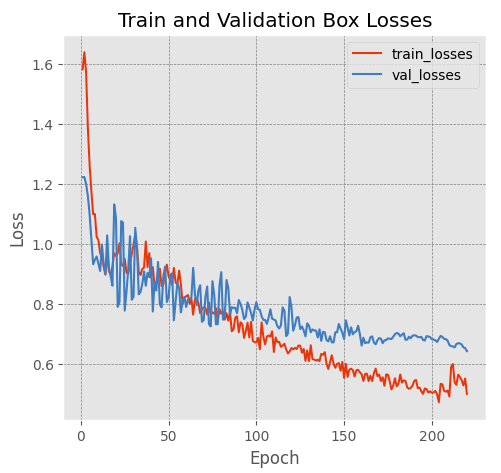
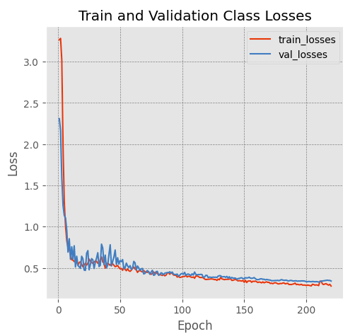

# Yolov8_Tutorial_Fish_Detection

## Overview
This project focuses on the detection and tracking of fish in images using the YOLO (You Only Look Once) object detection model. The primary goal is to identify fish in various images, annotate them with bounding boxes, and understand their movement patterns.

## Table of Contents
- [Key Features](#key-features)
- [Usage](#usage)
- [Training and Validation Loss](#training-and-validation-Loss)
- [Result Demonstration](#result-demonstration)
- [Future Enhancements](#future-enhancements)

## Key Features

1. **Data Preparation**:
   - Importing essential libraries for image processing, data manipulation, and visualization.
   - Displaying sample images from the validation set for a preliminary view of the dataset.

2. **YOLO Model Training**:
   - Training the YOLO model from the Ultralytics library on the dataset.
   - Visualizing training and validation losses (both box and class losses) over epochs.

3. **Predictions and Visualizations**:
   - Using the trained YOLO model to predict object detections on sample images.
   - Annotating detected objects with bounding boxes and displaying labels, coordinates, and confidence scores.

## Usage

To run the notebook:
1. Download the `.ipynb` file from the repository.
2. Upload it to Kaggle or any Jupyter Notebook environment.
3. Ensure you have the necessary datasets and libraries installed.
4. Execute the cells in sequence.

## Training and Validation Loss

During our training process, we observed the following trends in training and validation loss:

*Figure 1: Box Loss over Epochs*

*Figure 2: Classification Loss over Epochs*

## Result Demonstration

Below is a GIF showcasing the result of our model after the training process:

## Future Enhancements

- Extend the model to detect multiple species of fish.
- Implement real-time tracking of fish in video streams.
- Integrate with underwater cameras for real-world applications in marine biology and fisheries.
